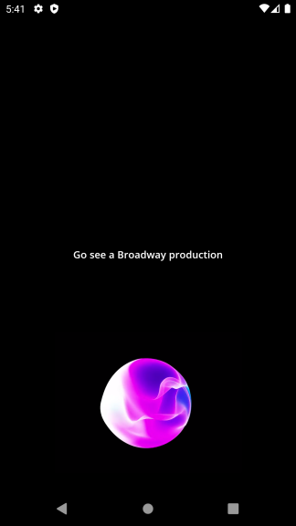

# The Bored App (Retrofit with MVVM Architecture in Kotlin) 

**The Bored App** is a simple app which helps you get cool ideas/activities which you can perform when you got nothing much to do.
This app is written in Kotlin Language which uses Retrofit with MVVM Architecture.
This project will basically show you how to work with MVVM architecture using Live Data and Retrofit to fetch Data.

Below is the breif description about MVVM, LiveData, Reposiotry, Retrofit etc. 

So, Let's Begin.

## 1. What is MVVM? 

**Answer:** Model-View-ViewModel (i.e, MVVM) is a type of client application architecture which is an alternative to MVC and MVP architectures.
MVVM says that all the business logic should be written in seperate class which should be independent from the presentation logic.

## 2. What is LiveData? 

**Answer:** LiveData is an observable data holder class. Unlike a regular observable, LiveData is lifecycle-aware, meaning it respects the lifecycle of other app components, such as activities, fragments, or services. This awareness ensures LiveData only updates app component observers that are in an active lifecycle state.

## 3. Why do we use LiveData? 

**Answer:** LiveData comes with many Advantages. Following are some of the main reasons for using LivaData in Android Projects.

**Instant Change on UI:** LiveData notifies the Observer objects if there's any kind of change in lifecycle state. Instead of refreshing the UI everytime, your Observer Object can update the UI if there's any change in the data.

**Avoiding Memory Leaks:** Observer objects are bound to lifecycle objects which destroy themselves when their associated lifecycle is destroyed.

**Avoid Application Crashes:** If Observers Lifecycle is not active then it will not going to receive any LiveData Events. 

**Automatic Lifecycle Handling:** UI components simply observe the data through Observers without actually stopping or resuming the observation. LiveData manages all these things automatically as it is aware about the lifecycle status.

**Always offers the latest data:** If an activity or fragment is destroyed or recreated like when device is rotated then also UI will hold the latest Data as LiveData Observers immediately receives the latest available data.

## 4. What do you mean by ViewModel? 

**Answer:** The ViewModel is a class which contains all the business logic and it manages the ui related data in a lifecycle conscious way.

## 5. Explain the term Model in MVVM?

**Answer:** Model classes are non-visual classes that encapsulate the app's data. Therefore, the model can be thought of as representing the app's domain model, which usually includes a data model along with business and validation logic. Examples of model objects include data transfer objects (DTOs), Plain Old CLR Objects (POCOs), and generated entity and proxy objects.

## 6. What do you mean by Repository? 

**Answer:** Repository is reponsible for handling data operations. You can consider repository as a mediator between various data sources.

## Final Words

The Main aim for creating this project is to demonstrate the working of Retrofit with MVVM architecture which is currently the best and safest development architectural pattern recommended by Google.